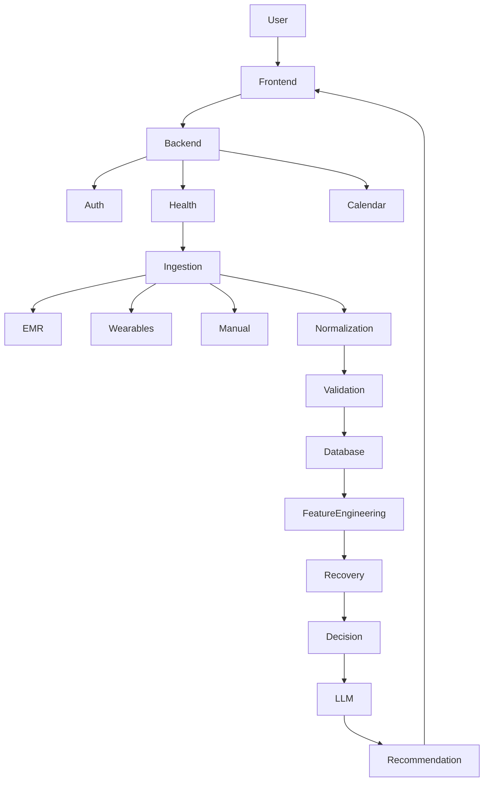
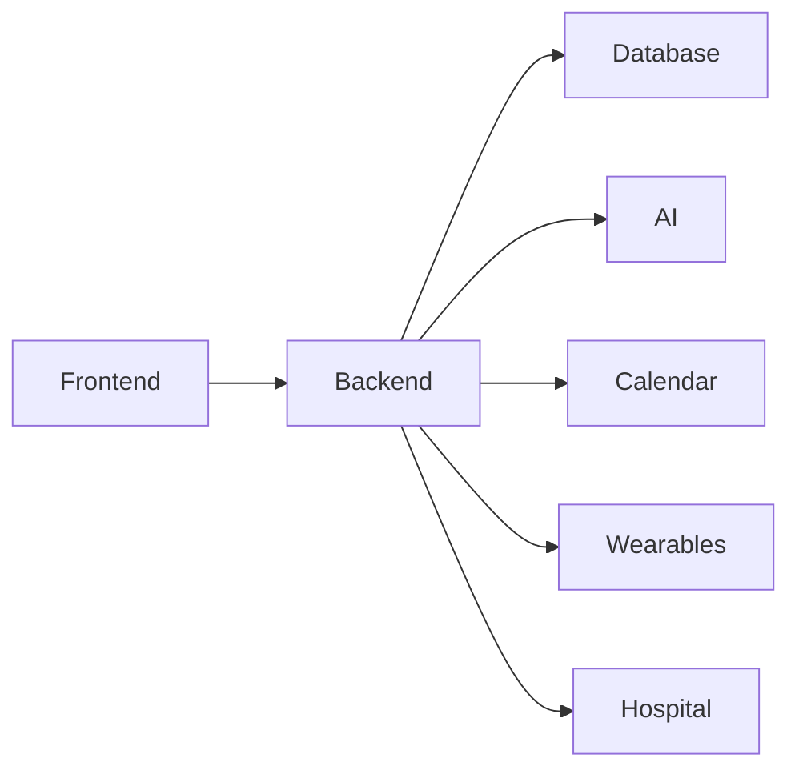
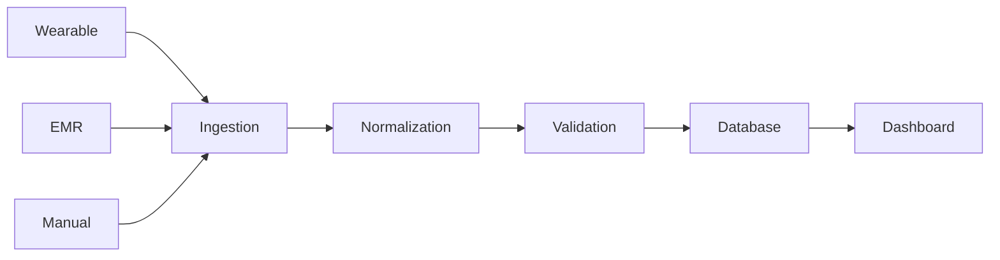
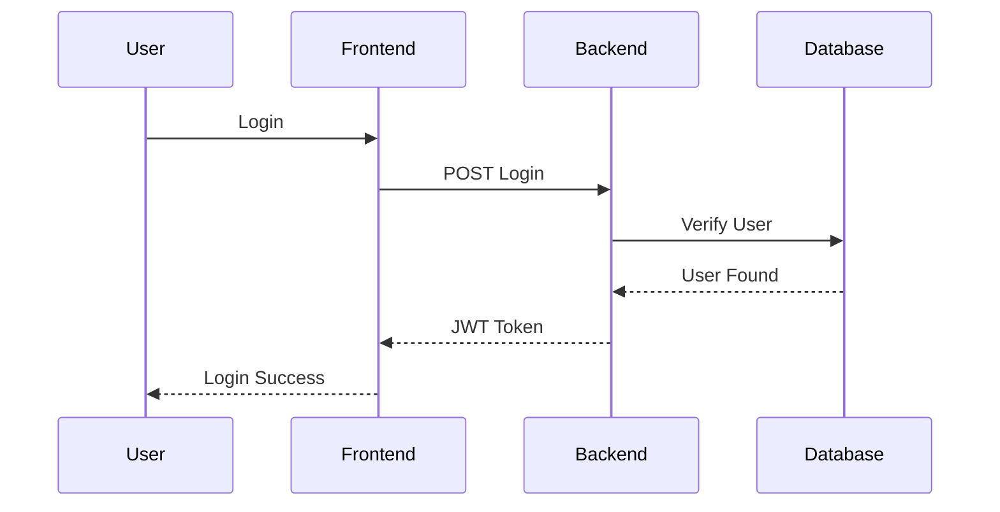

# Architecture Diagrams

# BioSync AI
### System Architecture Documentation

| Document Version | 1.0 |
|------------------|-----|
| Document Type | Architecture Diagrams |
| Project | BioSync AI |
| Prepared By | Priyansh Aggarwal |
| Last Updated | July 2026 |

---

# Table of Contents

1. System Architecture
2. Component Diagram
3. Health Data Flow
4. Authentication Flow
5. AI Processing Flow
6. Google Calendar Flow
7. Database Flow
8. Deployment Diagram
9. Future Architecture

---

# 1. System Architecture



---

# 2. Component Diagram



---

# 3. Health Data Flow



---

# 4. Authentication Flow



---

# 5. Recovery Engine Flow

```mermaid
flowchart TD

Health Metrics

↓

Feature Engineering

↓

Recovery Engine

↓

Recovery Score

↓

Decision Engine

↓

Recommendation Engine

↓

LLM

↓

Dashboard
```

---

# 6. Google Calendar Flow

```mermaid
flowchart LR

Recovery Score

-->

Decision Engine

-->

Calendar Service

-->

Google Calendar

-->

Suggested Schedule

-->

Dashboard
```

---

# 7. Database Flow

```mermaid
flowchart LR

Users

-->

Patients

-->

Health Metrics

-->

Daily Summary

-->

Recovery Score

-->

Recommendations
```

---

# 8. Deployment Diagram

```mermaid
graph TD

Browser

↓

React

↓

FastAPI

↓

PostgreSQL

↓

TimescaleDB

FastAPI --> Ollama

FastAPI --> Google Calendar API
```

---

# 9. Future Architecture

```mermaid
graph TD

Frontend

↓

API Gateway

↓

Auth Service

↓

Health Service

↓

AI Service

↓

Calendar Service

↓

Notification Service

↓

Analytics Service

↓

Database
```

---

# Summary

The architecture follows a modular monolith pattern where independent modules communicate through service interfaces.

Future versions can extract these modules into independent microservices without changing the frontend.