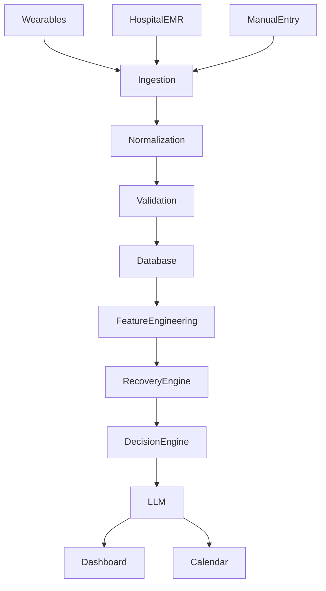
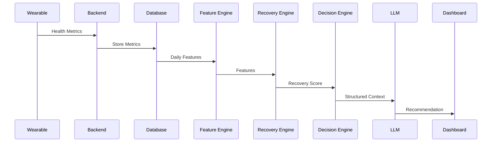

# AI Architecture

# BioSync AI
### Artificial Intelligence Architecture Document

| Document Version | 1.0 |
|------------------|-----|
| Project | BioSync AI |
| Document Type | AI Architecture |
| Prepared By | Priyansh Aggarwal |
| Last Updated | July 2026 |

---

# Table of Contents

1. Introduction
2. AI Philosophy
3. AI Pipeline
4. Health Intelligence Layer
5. Recovery Engine
6. Decision Engine
7. LLM Health Coach
8. Google Calendar Intelligence
9. Prompt Engineering
10. AI Data Flow
11. Future AI Roadmap
12. Conclusion

---

# 1. Introduction

BioSync AI is designed as an AI-powered health intelligence platform.

Unlike traditional health applications that simply display health metrics, BioSync AI analyzes structured health data and transforms it into personalized recommendations.

The system follows a **hybrid AI architecture**, combining deterministic health rules, feature engineering, and Large Language Models (LLMs).

The AI never makes medical diagnoses or replaces healthcare professionals.

---

# 2. AI Philosophy

The AI architecture is built on three principles.

## 1. Deterministic Decisions

Critical health decisions should always be reproducible.

Example

```
Recovery Score < 30

↓

Recommend Recovery Day
```

The recommendation is generated through predefined business logic.

---

## 2. Explainable AI

Every recommendation should have an explanation.

Example

```
Recommendation

Recovery Day

Reason

Low Sleep
High Resting Heart Rate
Poor Hydration
```

---

## 3. LLM as an Assistant

The LLM is responsible for communication rather than prediction.

Instead of deciding

"What should happen?"

it explains

"Why it should happen."

---

# 3. AI Pipeline



---

# 4. Health Intelligence Layer

The Health Intelligence Layer converts raw health information into structured insights.

Input Sources

- Hospital EMR
- Wearables
- Manual Entry

Generated Features

- Sleep Duration
- Sleep Debt
- Weekly Sleep Average
- Average Heart Rate
- Resting Heart Rate
- Hydration
- Activity
- Calories Burned

These features become inputs for downstream AI components.

---

# 5. Recovery Engine

The Recovery Engine computes a personalized recovery score.

Inputs

- Sleep Duration
- Resting Heart Rate
- Activity
- Hydration

Output

```
Recovery Score

0–100
```

Example

| Metric | Value |
|---------|-------|
| Sleep | 6.2 Hours |
| Hydration | 1.7 L |
| Resting HR | 72 BPM |
| Steps | 8100 |

↓

```
Recovery Score

82
```

---

# Recovery Calculation

Version 1 uses a weighted scoring model.

Example

```
Recovery Score

=

Sleep Score × 40%

+

Heart Rate Score × 25%

+

Hydration Score × 15%

+

Activity Score × 20%
```

Future versions may replace this model with machine learning algorithms.

---

# 6. Decision Engine

The Decision Engine converts recovery scores into structured actions.

Example

```
Recovery > 80

↓

Maintain Current Schedule
```

---

```
Recovery 50–80

↓

Moderate Activity
```

---

```
Recovery < 50

↓

Recommend Recovery Day
```

Example Output

```json
{
  "action":"MOVE_WORKOUT",
  "priority":"HIGH",
  "reason":"Recovery below threshold"
}
```

The Decision Engine contains deterministic business rules.

---

# 7. LLM Health Coach

The LLM converts structured recommendations into natural language.

Input

```json
{
 "Recovery":42,
 "Reasons":[
   "Low Sleep",
   "Poor Hydration"
 ]
}
```

Output

```
Your recovery is below average today because your sleep duration was lower than usual and your hydration levels were insufficient.

Consider light exercise, increased water intake, and an earlier bedtime.
```

Version 1 uses

- Ollama
- Llama 3

Future versions may support

- GPT
- Gemini
- Claude

---

# 8. Google Calendar Intelligence

The Calendar Intelligence module uses AI-generated recommendations to improve daily schedules.

Workflow


Examples

Low Recovery

↓

Move Workout

---

Poor Sleep

↓

Add Afternoon Recovery Break

---

Low Hydration

↓

Create Hydration Reminder

The system suggests changes rather than automatically modifying user schedules.

---

# 9. Prompt Engineering

Prompt Template

```
You are an AI Health Coach.

Use only the provided structured health data.

Do not diagnose diseases.

Explain the user's recovery score in simple language.

Provide practical wellness recommendations.

Avoid medical claims.

Limit the response to 150 words.
```

---

# Safety Rules

The LLM must never

- Diagnose diseases
- Recommend medications
- Modify prescriptions
- Predict life-threatening conditions
- Replace medical professionals

Instead

The LLM focuses on

- Recovery
- Lifestyle
- Wellness
- Daily planning

---

# 10. AI Data Flow



---

# 11. Future AI Roadmap

## Version 2

- Sleep Forecasting
- Fatigue Prediction
- Weekly Health Reports

---

## Version 3

- Nutrition Intelligence
- Stress Prediction
- Habit Analysis

---

## Version 4

- Disease Risk Prediction
- Multi-Agent AI
- Doctor Assistant
- Clinical Decision Support

---

# 12. Conclusion

The BioSync AI architecture separates deterministic health intelligence from natural language generation.

Structured health analytics produce reliable recovery scores and recommendations.

The LLM enhances user experience by explaining these recommendations in clear, personalized language without replacing evidence-based decision making.

This layered approach improves reliability, transparency, maintainability, and future scalability.