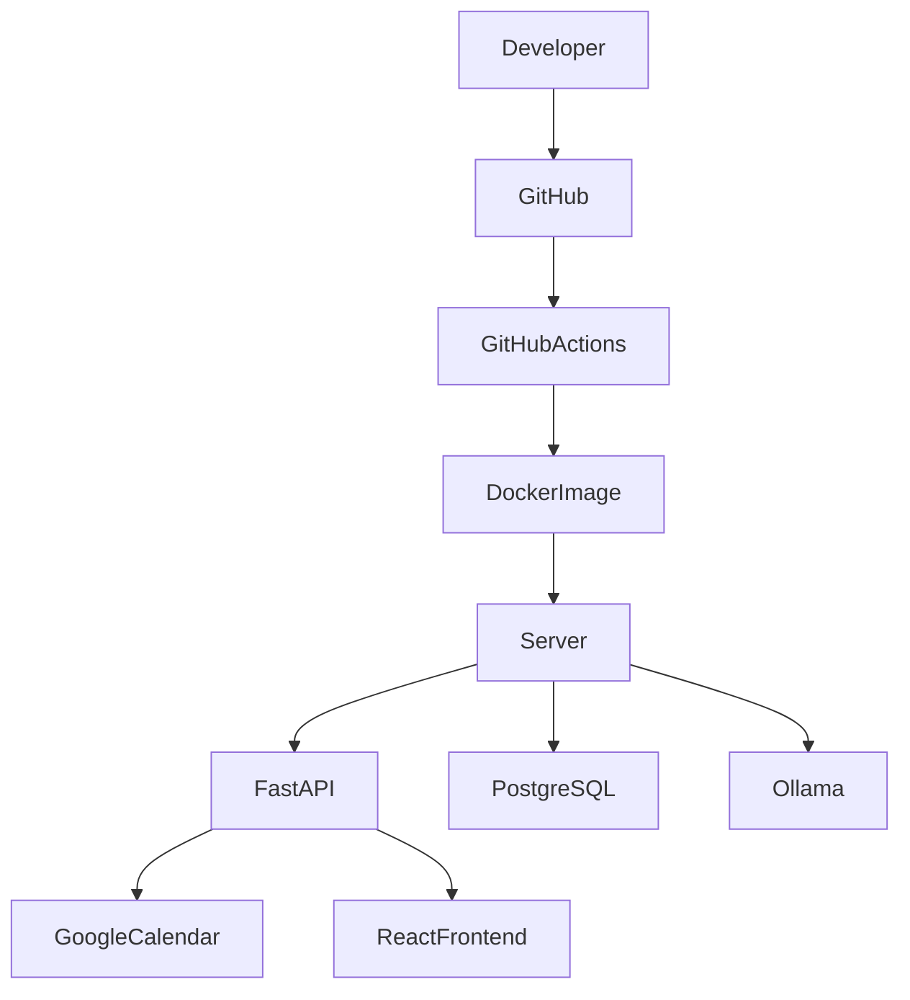

# Deployment Guide

# BioSync AI
### Deployment & Infrastructure Documentation

| Document Version | 1.0 |
|------------------|-----|
| Project | BioSync AI |
| Document Type | Deployment Guide |
| Prepared By | Priyansh Aggarwal |
| Last Updated | July 2026 |

---

# Table of Contents

1. Introduction
2. Deployment Architecture
3. System Requirements
4. Technology Stack
5. Local Development Setup
6. Docker Deployment
7. Environment Variables
8. Production Deployment
9. CI/CD Pipeline
10. Monitoring & Logging
11. Backup Strategy
12. Scaling Strategy
13. Future Improvements

---

# 1. Introduction

This document describes the deployment architecture of BioSync AI.

The objective is to provide a repeatable deployment process for development, testing, and production environments.

Deployment environments:

- Development
- Staging
- Production

---

# 2. Deployment Architecture



---

# 3. System Requirements

## Minimum

CPU

- Dual Core

RAM

- 8 GB

Storage

- 20 GB SSD

Python

- 3.12+

Docker

- Latest

Node

- 20+

---

## Recommended

CPU

- 8 Cores

RAM

- 16 GB

Storage

- 100 GB SSD

GPU

- Optional (for larger LLMs)

---

# 4. Technology Stack

## Frontend

- React 19
- TypeScript
- Tailwind CSS

---

## Backend

- FastAPI
- SQLAlchemy
- Pydantic

---

## Database

- PostgreSQL
- TimescaleDB

---

## AI

- Ollama
- Llama 3

---

## Infrastructure

- Docker
- Docker Compose
- Nginx

---

## Version Control

- Git
- GitHub

---

# 5. Local Development Setup

## Clone Repository

```bash
git clone https://github.com/priyanshaggarwal001/biosync-ai.git

cd biosync-ai
```

---

## Backend

```bash
cd backend

python -m venv .venv

source .venv/bin/activate

pip install -r requirements.txt
```

---

## Frontend

```bash
cd frontend

npm install

npm run dev
```

---

## Database

```bash
docker compose up postgres
```

---

## Run Backend

```bash
uvicorn app.main:app --reload
```

---

# 6. Docker Deployment

Project Structure

```
biosync-ai/

docker-compose.yml

backend/

frontend/

postgres/

docs/
```

---

Run Entire Project

```bash
docker compose up --build
```

---

Stop

```bash
docker compose down
```

---

# 7. Environment Variables

Backend

```env
DATABASE_URL=

SECRET_KEY=

JWT_SECRET=

JWT_ALGORITHM=

OLLAMA_HOST=

GOOGLE_CLIENT_ID=

GOOGLE_CLIENT_SECRET=

GOOGLE_REDIRECT_URI=
```

Frontend

```env
VITE_API_URL=
```

---

# 8. Production Deployment

Recommended Infrastructure

```text
Internet

↓

Nginx

↓

React Frontend

↓

FastAPI

↓

PostgreSQL

↓

TimescaleDB

↓

Ollama

↓

Google Calendar API
```

---

# 9. CI/CD Pipeline

Workflow

```mermaid
flowchart LR

Developer

-->

GitHub

-->

GitHub Actions

-->

Run Tests

-->

Build Docker Image

-->

Deploy
```

Pipeline Steps

1. Push Code

2. Run Linter

3. Execute Unit Tests

4. Build Docker Image

5. Deploy Backend

6. Deploy Frontend

---

# 10. Monitoring & Logging

Application Logs

- API Requests
- Authentication
- Validation Errors
- Recovery Engine Logs
- LLM Requests

Database Logs

- Slow Queries
- Connection Errors

Future Monitoring

- Prometheus

- Grafana

- Loki

---

# 11. Backup Strategy

Daily

Database Backup

Weekly

Full Backup

Monthly

Archive Backup

Recommended

Object Storage

Examples

- AWS S3

- Google Cloud Storage

---

# 12. Scaling Strategy

Current Architecture

```
React

↓

FastAPI

↓

PostgreSQL

↓

Ollama
```

Future

```mermaid
flowchart TD

LoadBalancer

↓

React

↓

API Gateway

↓

FastAPI

↓

Redis

↓

PostgreSQL

↓

AI Server
```

Possible Future Improvements

- Redis Cache

- Celery Workers

- Kubernetes

- Horizontal Scaling

---

# 13. Security

Production Checklist

- HTTPS

- JWT Authentication

- Password Hashing

- Secure Cookies

- SQL Injection Protection

- XSS Protection

- CSRF Protection

- Environment Variables

- API Rate Limiting

---

# 14. Future Improvements

Version 2

- Kubernetes

- Redis

- Celery

Version 3

- AWS Deployment

- Terraform

- Auto Scaling

Version 4

- Multi-region Deployment

- AI Cluster

- Disaster Recovery

---

# Deployment Summary

BioSync AI is designed using a containerized deployment strategy with Docker, PostgreSQL, TimescaleDB, FastAPI, and React.

The deployment architecture supports local development while providing a clear migration path toward cloud-native production deployments using CI/CD pipelines, monitoring, and scalable infrastructure.